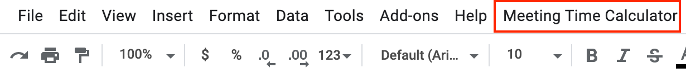
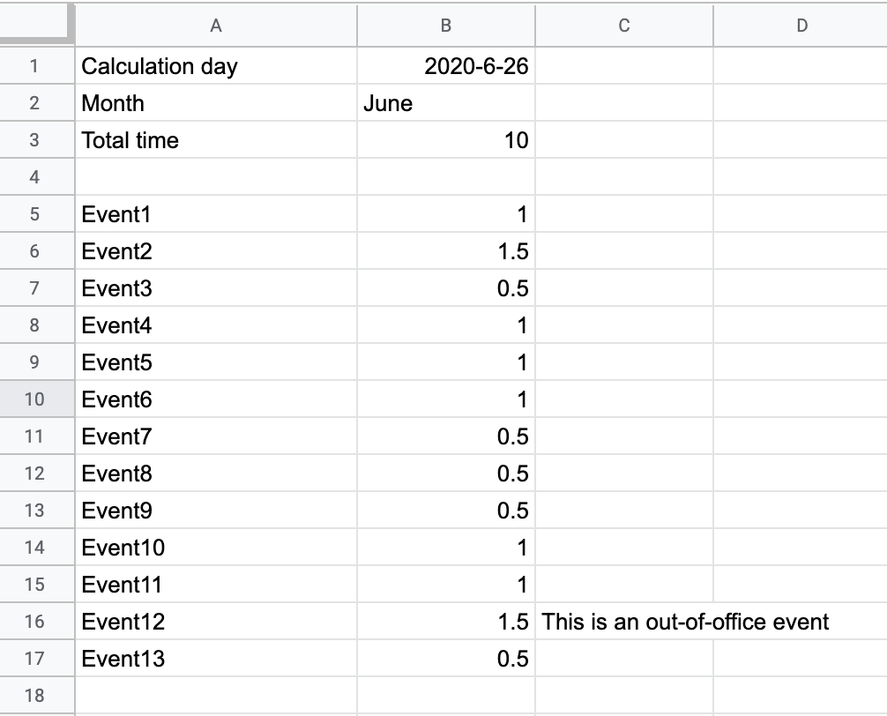

# Google Spreadsheet Meeting Time Calculator for PMS

Please find here the file for the  meeting time calculatior for PMS.

I am not able to publish it as Sheets add-ons so the easiest way is to copy the content of the **pmscalculator.gs** file into a Google Spreadsheet from **Tools** -> **<>Script editor**.

Please replace the actual content
```js
function myFunction() {

}
```
with the one from  **pmscalculator.gs** and save it.

Later, go back to the Spreadsheet and reload the page, you should be able to see a new item **Meeting Time Calculator** on the menu.


Click to select a cell from where you would like to start inserting the meeting time calculation and details.
Next, click on the **Meeting Time Calculator** from the menu and select **Get Total Time**.
Wait a little and you could see the results populating the cells.


The actual list of events from your own calendar will be seen instead of Event1...Eventxxx

### TODO
- [ ] Automatically remove TGIF events and other out-of-office times

### Contributing
Feel free to contribute and improve the quality of the code.


Thank you very much !
